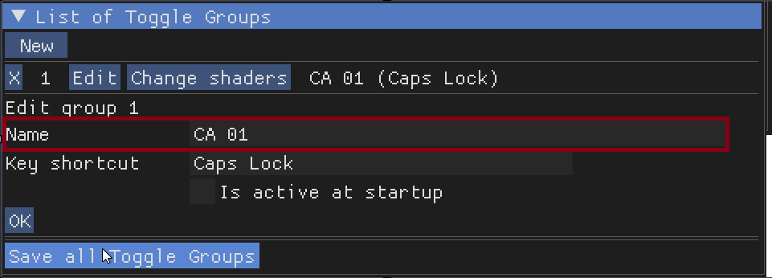

# Shader Toggler

The Shader Toggler is a powerful tool for disabling or toggling shaders in games. This guide will walk you through the process of using the Shader Toggler add-on with ReShade.

For this guide, we will be using a free game called "Mimic Search," which can be downloaded from [Steam](https://store.steampowered.com/app/2713460/Mimic_Search/).

## Preface

To get started, you will need to download the ReShade add-on version. You can find more information on this [here](../reshade/reshadeversions.md).

## Requirements

To use the Shader Toggler, you will need to download the add-on itself from the [official GitHub repository](https://github.com/FransBouma/ShaderToggler/releases). Make sure to download the correct version for your game.


## Installation

Install the game and ReShade with the ShaderToggler.addon64. Ensure that all other ReShade shaders are turned off to avoid conflicts.

## 1. Accessing the Add-on

Launch the game and access the ReShade menu. Navigate to the add-on tab:


Minimize other add-ons to make it clearer. Ensure you are in the game and have a problematic effect like Chromatic Aberration visible:


## 2. Setting Up the Add-on

Move the ReShade menu to the right and press "New." The menu will change, and you should click on "Edit":


## 3. Configuring the Add-on

Enter a name for the effect, such as "CA 01," in the "Name Box":



## 4. Setting Up a Shortcut

Set up a shortcut, such as "Ctrl + 1", for the first group. Click the "Shortcut Box" and press the shortcut keys, then press "OK":


You can choose to activate the add-on at startup or not. Press "OK" again.

## 5. Hunting for Shaders

Click the "Change shaders" button and let it run for a bit:


The process will look like this:


And then change to this:


## 6. Navigation and Saving

Use the Num Pad to navigate and save shaders:

* Keys 1 & 2: Navigation and 3: Save for Pixel Shaders
* Keys 4 & 5: Navigation and 6: Save for Vertex Shaders
* Keys 7 & 8: Navigation and 9: Save for Compute Shaders

In this case, we will use keys 1 and 2 to hunt for the shader. Once found, save it by pressing 3:


Click "Done" and press the shortcut to activate the add-on:


The shader should now be disabled. Repeat the process for other shaders in the game.

## 7. Saving Your Progress

Click the "Save all Toggle Groups" button to save your progress:


The save file will be located where the game exe/add-on is. Here is an example of what the save file might look like:

```
[General]
AmountGroups=1

[Group0_VertexShaders]
AmountHashes=0

[Group0_PixelShaders]
ShaderHash0=3090188387
AmountHashes=1

[Group0_ComputeShaders]
AmountHashes=0

[Group0]
Name=CA 01
ToggleKey=822083840
IsActiveAtStartup=False
```

## Conclusion

With the Shader Toggler, you can now disable or toggle shaders in games. Remember to save your progress and repeat the process for other shaders. Good luck and happy shader hunting!

Here is an image from in-game with the effect disabled:


> Chromatic Aberration - Off
