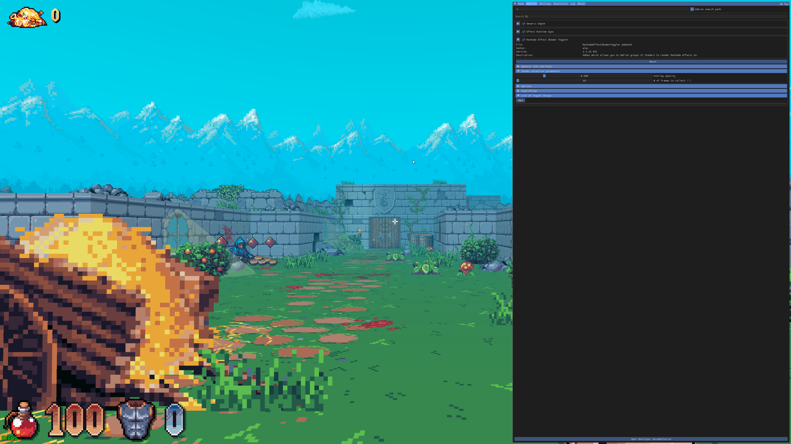
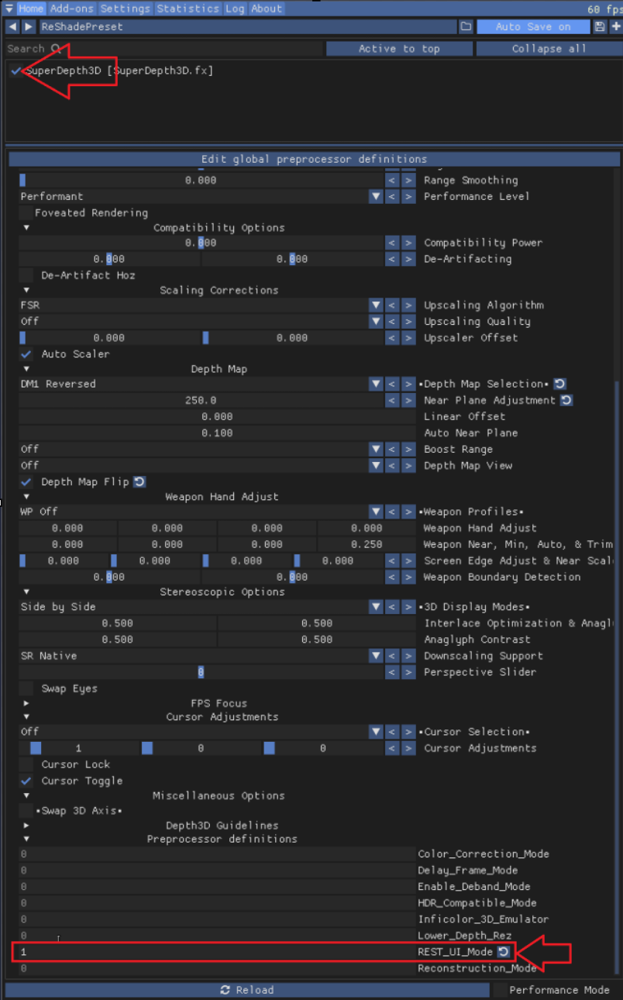

# Reshade Effect Shader Toggler (R.E.S.T)

The Reshade Effect Shader Toggler (R.E.S.T) is a powerful tool used to separate effects from the game and layer ReShade shaders under the isolated element.

## Introduction

To get started with R.E.S.T, you will need to download the add-on from the [official GitHub repository](https://github.com/4lex4nder/ReshadeEffectShaderToggler/releases/tag/v1.3.15).

## Downloading and Installing the Add-on

The release folder contains several files, including shaders, FX files, a license, and a README file. You can ignore the license and README files for now. You will need to use one of the `.addon#` files, but you can drag both into the same area where the ReShade.dll is located. For this guide, we will focus on the 64-bit add-on.

## Installing the Add-on

Place the `ReshadeEffectShaderToggler.addon64` file in the same location where you installed ReShade. This is usually in the game folder, near the `dxgi.dll` file.

## Choosing a Game

For this guide, we will use the game [Wiz⊙rdum](https://store.steampowered.com/app/1715590/Wizordum/). However, you can use R.E.S.T with other games as well.

## Setting Up the Add-on

Your game folder should look like this:

Make sure you have ReShade installed and the add-on file in the correct location.

## Launching the Game and Add-on

Start the game, and ReShade should load with the add-on enabled. You can find the add-on in the Add-on Tab:

Click the arrow to open the add-on, and close other add-ons to make it cleaner.

## Configuring the Add-on

The add-on should look like this:

Close the ReShade menu and go in-game to use the add-on.

## Setting Up the Add-on in-game
Open ReShade, move it to the right, and click `New`:

A new window will open:

Follow these steps:

1. Click `1. Activate [x]`
2. Click `2. Edit`
3. Type a name in the `3. Name` field
4. Create a `4. Shortcut`
5. Click `5. OK`

## Enabling 3D Shader

If you want to use SuperDepth3D with R.E.S.T, you need to enable the 3D shader. Open the main menu, enable the 3D shader, and scroll down to the bottom of the shader. Enable `REST_UI_MODE` by setting it to `1`:

## Configuring the Add-on Settings

Go back to the Add-on Tab and click `Settings`:

A new window will open:

Follow these steps:

1. Click off `Apply all enabled techniques [ ]`
2. Mark the 3D shader `[x]`

## Isolating the UI

Focus on the list of active buffers:

Find the buffer that isolates the UI. Double-click the hex value to select it:

The selected buffer should turn yellow.

## Saving Your Progress

Close the window and click `Save all Toggle Groups`:

## Troubleshooting

You may notice issues with the center crosshair. There are three ways to deal with this:

1. Check if the game allows you to remove it
2. Use the ShaderToggler
3. Mod the game to remove the texture

## Cursor Adjustments

If you experience issues with the cursor in Side by Side and Top n Bottom formats, go to the `Shader Settings` and look for `Cursor Adjustments`:

Set the cursor type to the one you prefer:

You can use `Mouse 5` to switch layers.

## Sharing Your Configuration

When you click `Save all Toggle Groups`, a file called `ReshadeEffectShaderToggler.ini` is generated in the same folder as the add-on. You can share this file with others by posting it on the [ReShade forum](https://discord.com/channels/305472403977404416/1248039510244065410).
