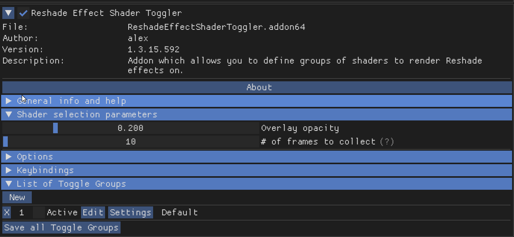

# Reshade Effect Shader Toggler (R.E.S.T)

Used to separate effects from the game and layer ReShade shader under the isolated element.

## "How do we start?"

Welp, we are going to need to download the add-on first.

You can download it from [here](https://github.com/4lex4nder/ReshadeEffectShaderToggler/releases/tag/v1.3.15).

## "What with the multi files in there? What's going on where am I? What year is it? Do I need all the bits?"

Wow... Hang on there. So the contents of the release folder should be a few shaders the FX files.

There s also a License and a README File inside that folder.
Ignore them for now.

Yes, you do need all the bits. Well, You really only need one of the `.addon#`. But, you could drag them both in the same area where the ReShade.dll is.

But, for are case we are going to to focus on the 64 bit add-on.

## "OK, Stop, I grabbed that ReshadeEffectShaderToggler.addon64 where do I put it again?"

You place this add-on where you installed **ReShade** too. So look for the game folder and look for dxgi.dll in this case.

Note: REST add-on can or may work for other api's. But, the support is spotty. So we are focusing on a simple game in the hopes that it will be more understandable.

## "Wait, What game?"

So in this guide I am going to focus on a game called, [Wiz⊙rdum](https://store.steampowered.com/app/1715590/Wizordum/).

But, you can use REST in a lot of different games in the image use for the post. That is DaggerFall Unity.

Your folder should look like this.

> Record Scratch You must be wondering how you got here.

Well, I assumed that you already have the game installed. Also assumed that you installed ReShade already. This is why the image looks like this.

A Basic ReShade install guide will be added later and linked here.

## "OK, my files look like this in the game what should I do now?"

Now, you should be able to start the game. ReShade should load and the add-on should be on the Add-on Tab.

Click the little arrow to open the a add-on. Also make sure to close the other add-ons to make it cleaner looking.

Ok now that you done that it should look like this:

Ok close the ReShade menu and go in to the game. So we can use the add-on when we find in game UI.

The start of the game should be enough.

## "Now what? I am at the start of the game and I have control what do I do now?"

Open up, ReShade and move it to the right and it should look like this:

> I am going to incease the ReShade Text size to make it easier to read.

Now you should click on `New`.

It should open up like this:

You can now click `1. Activate [x]` and then click `2. Edit`.

Go ahead any type something in to the `3. Name` under the edit group.

Then you should make a `4. Shortcut.` Once that is done click `5. OK.`

The order should be:

1. Activate
2. Edit
3. Name
4. Shortcut
5. OK

Now lets move on to searching for the UI. This is where it get a little more strange since now a new Window opens once you press `Settings`.

Go ahead any type something in to the `3`. `Name` under the edit group.

Then you should make a `4. Shortcut`. Once that is done click `5. OK`.

The order should be:

1. Activate
2. Edit
3. Name
4. Shortcut
5. OK

Now lets move on to searching for the UI. This is where it get a little more strange since now a new Window opens once you press `Settings`:

