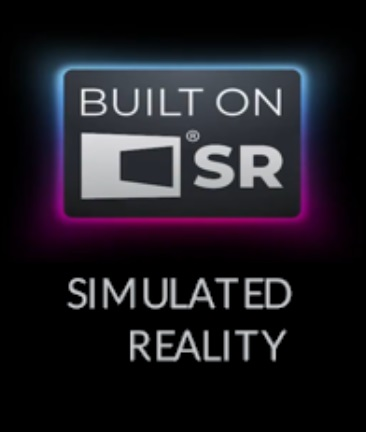
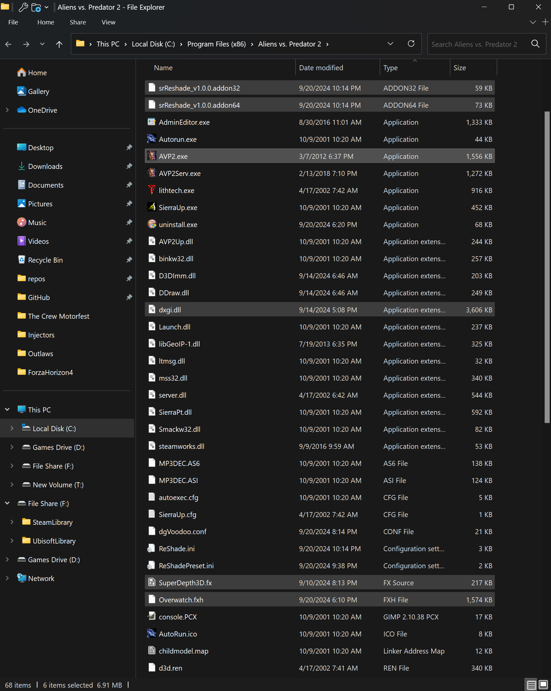
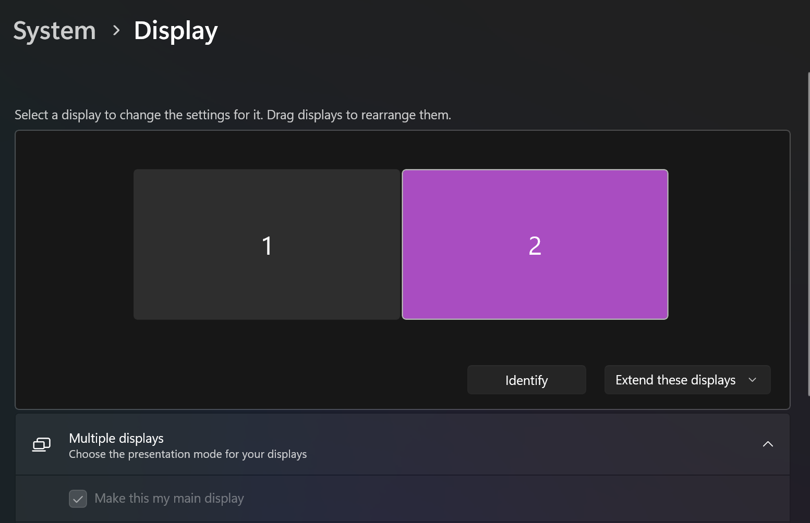

# Simulated Reality Displays

Simulated Reality (SR) Displays, formerly known as Dimenco, are now backed by Leia Inc. This guide will help you get SuperDepth3D working on hardware with SR technology.

Main Website: <https://www.leiainc.com/>

Hardware Developers Links:

* Acer [Spatiallabs](https://www.acer.com/us-en/spatiallabs)
* ASUS [Spatial Vision](https://www.asus.com/content/asus-spatial-vision-technology/)
* Sony [Spatial Reality](https://pro.sony/ue_US/products/spatial-reality-displays/3d-professional-images)

Please note that this guide is intended for hardware with the SR badge:

## Getting Started with SuperDepth3D

To use SuperDepth3D with SR Displays, you can follow either the easy text guide or the manual guide.

### Video Guide

For a video tutorial, please refer to this [video guide](https://youtu.be/ovXh54DkKbU).

> SuperDepth3D for Simulated Reality Displays.

## Easy Text Guide

To install ReShade and SuperDepth3D, follow these steps:

1. **Download ReShade**: Download the add-on version of [ReShade](https://reshade.me/#download).

    

2. **Install ReShade**: Install ReShade by running the ReShade.exe.

    

3. **Select Game Executable**: Select or browse for the game's executable. In this example, we will install it in Forza Horizon 4.

    

4. Click `Open`.
5. **Select API**: Select the API and click next.

    

6. **Select SuperDepth3D**: Select the Depth3D Repo and check `SuperDepth3D.fx`.

    

7. Click `Next`.
8. **Select 3DGameBridgeProjects Add-on**: Make sure to select the `3DGameBridgeProjects` add-on.

    

Click `Next` and then `Finish`.

## Manual Guide

If you prefer a more manual approach, follow these steps:

1. **Install ReShade**: Install ReShade or inject it into your game, ensuring you use the [add-on version of ReShade](https://reshade.me/#download).

    

    If ReShade is already installed, you can skip this step.

2. **Download 3DGameBridge**: Download the latest version of [3DGameBridge](https://github.com/JoeyAnthony/3DGameBridgeProjects/releases).

    

3. **Copy Add-ons**: Copy both add-ons or just the one you need, based on the game's architecture.

    

4. **Paste Add-ons**: Paste the add-ons where the game's executable is located or where the ReShade `.dll` is installed.

    

    > Please start the game to see if it works.

## Important Notes

When starting the game, you may need to set your primary monitor to the Simulated Reality Display. If not, the game may not select the correct screen, resulting in a black screen.

Additionally, ensure the game is running at its native resolution for the 3D display. If the resolution is too small, the image may appear distorted.

