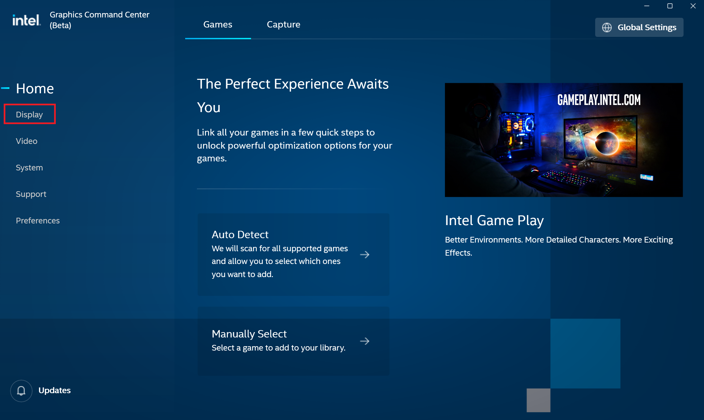
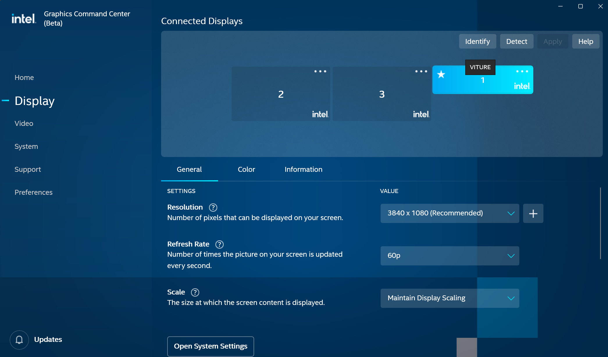
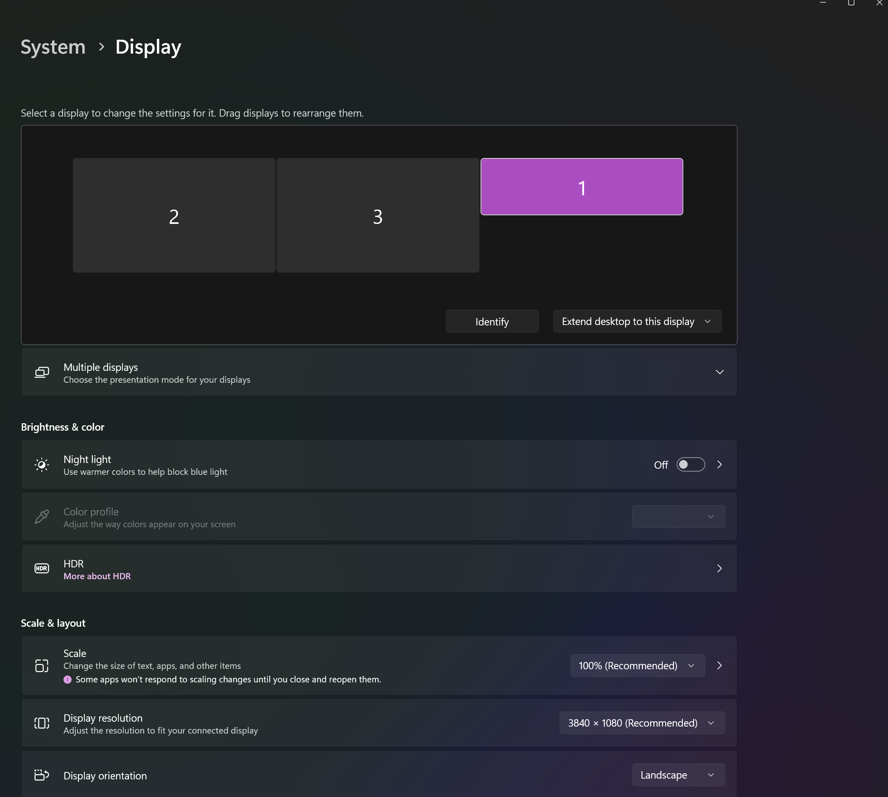

# VITURE

VITURE is a leading brand in the AR glasses market, offering a unique gaming experience. This guide is designed to help you set up your VITURE Gen 1 Glasses with SuperDepth3D, depending on your GPU.

> VITURE is one of the key players in the AR glasses industry.

## Setting Up VITURE with Intel GPU

To use your VITURE AR Glasses with an Intel GPU, follow these steps:

### Initial Steps

1. **Update your Arc Drivers**: Ensure you have the latest [Arc Drivers](https://www.intel.com/content/www/us/en/products/docs/discrete-gpus/arc/software/drivers.html) installed.

    

2. **Download Intel Graphics Command Center**: Install the [Intel Graphics Command Center](https://apps.microsoft.com/detail/9nmr79ztjftc?rtc=1&hl=en-us&gl=us) beta application.

    

### Configuring VITURE with Intel GPU

1. **Switch to 3D Mode**: Plug in your VITURE AR Glasses and switch them to 3D Mode by holding down the first button for a few seconds.

    Under Windows, it should be recognized as a 3840 x 1080p screen:

    

    > If you see this, it's a good sign.

2. **Launch Intel Graphics Command Center**: Start the Intel Graphics Command Center (BETA).

    

3. **Select Display Settings**: Click on `Display`.

    

4. **Select VITURE Screen**: Click on the `VITURE` screen.

    

5. **Change Resolution**: Go to settings and change the resolution from 3840 x 1080 to 1920 x 1080.

    

    

6. **Set Scale Size**: Change the scale size to `Stretched`.

    

7. **Verify Settings**: Your settings should now look like this:

    

Now you can start your game with SuperDepth3D and enjoy it in stereo 3D.

## Setting Up VITURE with NVIDIA GPU

To use your VITURE AR Glasses with an NVIDIA GPU, follow these steps:

1. **Update your NVIDIA Drivers**: Ensure you have the latest [NVIDIA Drivers](https://www.nvidia.com/en-us/drivers/) installed.

    

2. **Switch to 3D Mode**: Plug in your VITURE AR Glasses and switch them to 3D Mode by holding down the first button for a few seconds.

    

    Under Windows, it should be recognized as a 3840 x 1080p screen:

    

    > If you see this, it's a good sign.

3. **Launch NVIDIA Control Panel**: Start the NVIDIA Control Panel.

    

4. **Change Resolution**: Click on `Change Resolution` and set it to 1920 x 1080.

    

5. **Adjust Desktop Size and Position**: Go to `Adjust Desktop size and Position`, set it to Fullscreen, and the rest should default to the correct values.

    

Now you can start your game with SuperDepth3D and enjoy it in stereo 3D.
