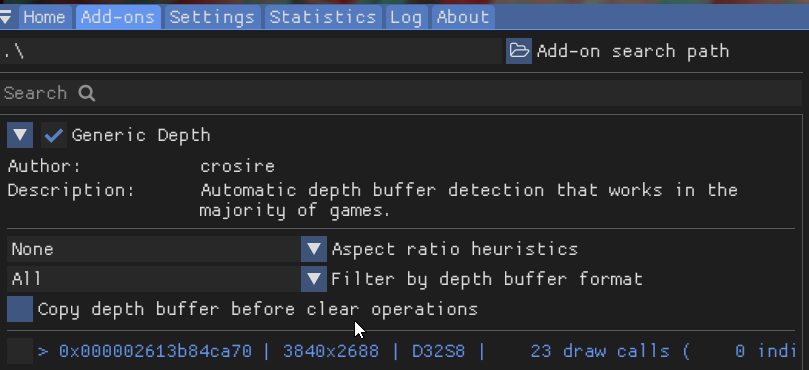

# PCSX2

This guide provides basic adjustments for ReShade and its use in PCSX2: Emulator.

## Introduction to PCSX2 Settings

We will be using the DX11 API for this guide due to its compatibility with other add-ons.

### Display Settings

To access the display settings, navigate to the menu shown below.

1. **Fullscreen Mode & Aspect Ratio:** Set the aspect ratio to "Fit to Window" as shown below.

    

    > This is necessary because the depth buffer is set to this internally.

2. **Anti-Blur:** Enable this option to minimize distortions.

    

## Rendering 

We will be using the DX11 API for rendering. You can try different APIs as long as you can get a depth buffer output.

### Rendering Options

To access the rendering settings, navigate to the menu shown below.

1. **Rendering:** Set the rendering to "Direct3D 11" as shown below.

    

    > This ensures compatibility with most of ReShade's add-ons.

2. **Internal Resolution:** Set the internal resolution to "Native" for most cases.

    

    > This also helps with ReShade's generic depth add-on.

## Installing and Configuring ReShade

To use ReShade with PCSX2, follow these steps:

1. Install ReShade under your current API setting. You can find the installation guide [here](../reshade/reshadeversions.md).
2. Turn off the emulator and install ReShade.
3. Start your game and go into the ReShade menu.
4. Check the depth buffer in the add-ons tab.

    

## Additional Information

Make sure to complete any additional setup, such as configuring games and BIOS, on your end.

## Conclusion

This guide provides a good starting point for using ReShade with PCSX2. However, note that the optimal settings may vary depending on the game.
