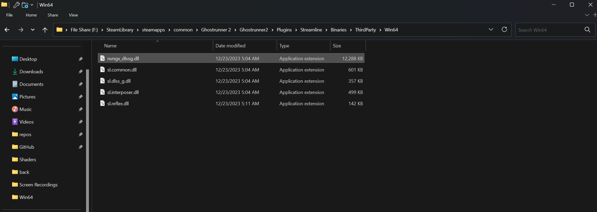

# Disabling DLSS Frame Generation

This Guide will Focus on two methods of disabling DLSS Frame Generation so you don't crash when starting/playing your game.

The first method I will show you will disable it in all games on Windows.

### Instructions

1. Go to `Display Settings`.

    

2. Next, go to `System > Display > Graphics` and click on `Change default  graphics settings`.

    

3. After you click on this you want to look for **`Hardware Accelerated GPU Scheduling`**

    

4. Turn off **`Hardware Accelerated GPU Scheduling`**

    

5. Reset your PC and it should globally disable Frame Generation.

## Demonstration: Ghost Runner 2

Will be use for this demonstration. For disabling it on a game individually. Most games will be similar.

### Instructions

1. You will be looking for a file called: `nvngx_dlssg.dll`

    In this case it's in the [Streamline](https://developer.nvidia.com/rtx/streamline) folder:

    

2. In this case all you need to do is rename `nvngx_dlssg.dll` to `nvngx_dlssg.back`

    

## Conclusion

That should be it for now. I will post more examples for other game later. Good luck.

