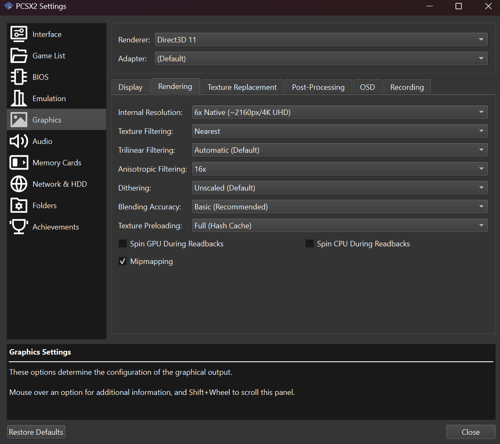

# PCSX2 Basic Settings

This Guide will focus on basic adjustments for ReShade and it's use in PCSX2: Emulator.

## Display

For this guide we will be using the DX11 API.

This is due to compatibility with other add-ons. Now please look at the settings in this menu.

1. You will be looking for `Fullscreen Mode & Aspect Ratio ` Like in the image below.

    

    > The reason we want to set Aspect Ratio to Fit to Window. Is because the depth buffer is set to this internally.

2. `Anti-Blur` is a good one to keep on to keep distortions to a minimal.

    

## Rendering

As I said above. We are focusing on DX11, You can always try different APIs as long you get a depth buffer out you should be fine.

1. Make sure to set Rendering to `Direct3D 11` for this example.

    

    > Because, we want compatibility with most of ReShade's add-ons.

2. Now we want to set our Internal Resolution: `Native` for most cases.

    

    > It also helps with ReShade own generic depth add-on.

## ReShade

You need to install ReShade under your current `API Setting`.

So Now please turn off the emulator and install [ReShade](reshadeversions.md).
Once that is done....

Please start your game and go into the ReShade menu and check the depth buffer.

This is in the add-ons tab inside the ReShade own menu.

## Extra Info

Make sure you do all the other things like the games and bios things on your end........... I will not explain that.

## Conclusion

This may not be the case for every game. But, this should be a good starting point.
