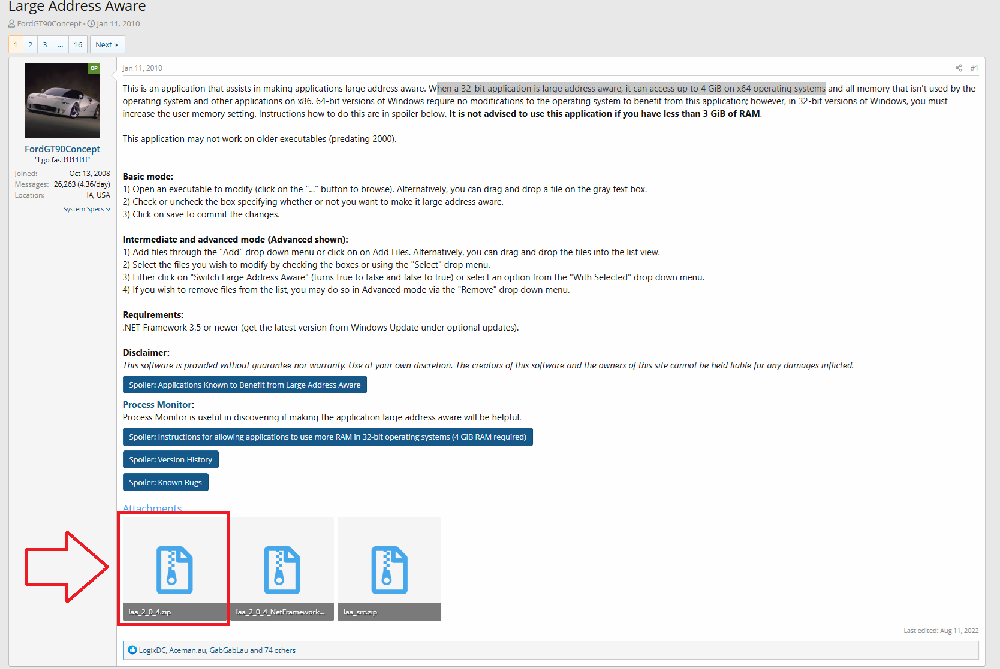

# Large Address Aware · 4G Patch

When a 32-bit application is Large Address Aware, it can access up to 4.0 GiB on x64 operating systems. Large Address Aware is needed to have ReShade work on DirectX 9.0 games that have memory limitations.

1. For more information please go to this [link](https://discord.com/channels/305472403977404416/1360552634431569956/1360552790836904037).

    

2. Download that file in the image and run it on the exe that has this limitation.

Game of note that have this issue are:

- https://store.steampowered.com/app/227600/Castle_of_Illusion/
- https://store.steampowered.com/agecheck/app/460790/
