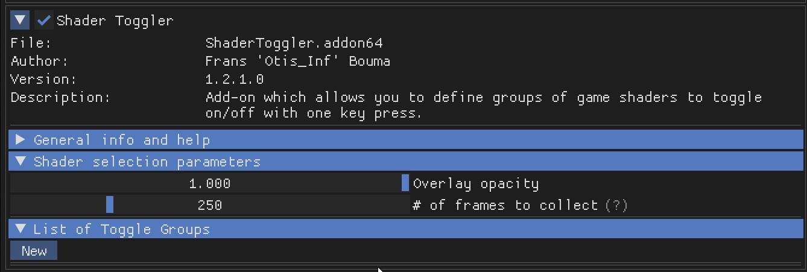
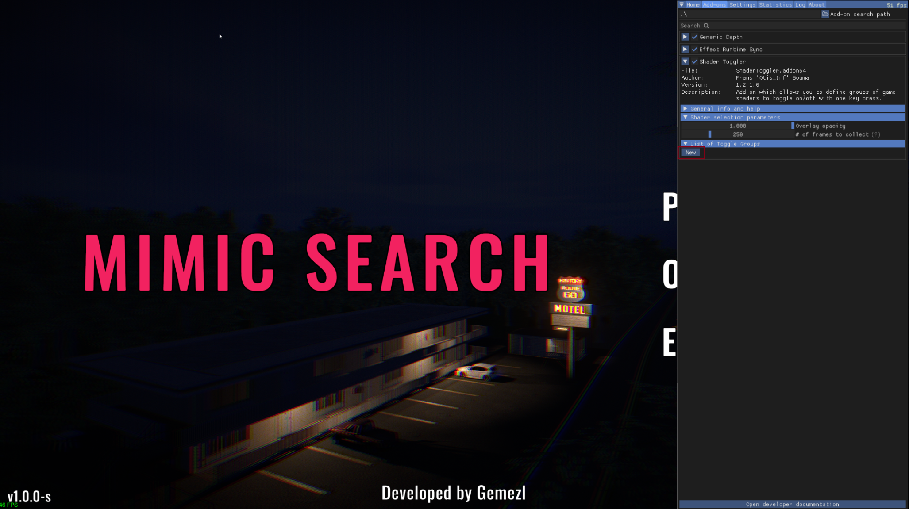
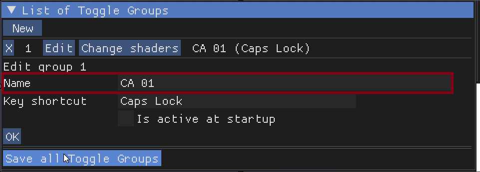
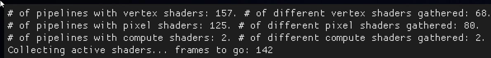
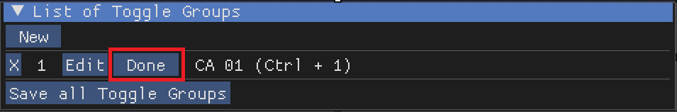
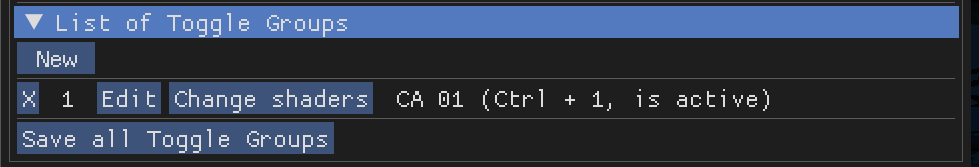

Shader Toggler
==============

The Shader Toggler is a powerful tool for disabling or toggling shaders in games. This guide will walk you through the process of using the Shader Toggler add-on with ReShade.

For this guide, we will be using a free game called *Mimic Search*, which can be downloaded from `Steam <https://store.steampowered.com/app/2713460/Mimic_Search/>`_.

Preface
-------

To get started, you will need to download the ReShade add-on version. You can find more information on this `here <../reshade/reshadeversions.md>`_.

Requirements
------------

To use the Shader Toggler, you will need to download the add-on itself from the `official GitHub repository <https://github.com/FransBouma/ShaderToggler/releases>`_. Make sure to download the correct version for your game.

   Screenshot of the Shader Toggler GitHub page.

Installation
------------

Install the game and ReShade with the :file:`ShaderToggler.addon64`. Ensure that all other ReShade shaders are turned off to avoid conflicts.

1. Accessing the Add-on
-----------------------

Launch the game and access the ReShade menu. Navigate to the :guilabel:`add-on` tab:

.. figure:: shadertoggler/shadertoggler2.png

   Screenshot of the ReShade :guilabel:`add-on` tab.

Minimize other add-ons to make it clearer. Ensure you are in the game and have a problematic effect like Chromatic Aberration visible:

.. figure:: shadertoggler/shadertoggler3.png

   In-game screenshot showing a visible Chromatic Aberration effect.

2. Setting Up the Add-on
------------------------

Move the ReShade menu to the right and press :guilabel:`New`. The menu will change, and you should click on :guilabel:`Edit`:

   Screenshot of the ReShade menu with the :guilabel:`New` button highlighted.

.. figure:: shadertoggler/shadertoggler5.png

   Screenshot of the ReShade menu with the :guilabel:`Edit` button highlighted.

3. Configuring the Add-on
-------------------------

Enter a name for the effect, such as "CA 01," in the :guilabel:`Name Box`:

   Screenshot showing the :guilabel:`Name Box` with "CA 01" entered.

4. Setting Up a Shortcut
------------------------

Set up a shortcut, such as :kbd:`Ctrl+1`, for the first group. Click the :guilabel:`Shortcut Box` and press the shortcut keys, then press :guilabel:`OK`:

.. figure:: shadertoggler/shadertoggler7.png

   Screenshot showing the :guilabel:`Shortcut Box` with :kbd:`Ctrl+1` configured.

You can choose to activate the add-on at startup or not. Press :guilabel:`OK` again.

5. Hunting for Shaders
----------------------

Click the :guilabel:`Change shaders` button and let it run for a bit:

.. figure:: shadertoggler/shadertoggler8.png

   Screenshot of the :guilabel:`Change shaders` button being clicked.

The process will look like this:

   Screenshot showing the :guilabel:`Hunting for shaders` process in progress.

And then change to this:

.. figure:: shadertoggler/shadertoggler10.png

   Screenshot showing the :guilabel:`Hunting for shaders` process completed.

6. Navigation and Saving
------------------------

Use the Num Pad to navigate and save shaders:

* :kbd:`1` & :kbd:`2` Navigation and :kbd:`3` Save for Pixel Shaders
* :kbd:`4` & :kbd:`5` Navigation and :kbd:`6` Save for Vertex Shaders
* :kbd:`7` & :kbd:`8` Navigation and :kbd:`9` Save for Compute Shaders

In this case, we will use keys :kbd:`1` and :kbd:`2` to hunt for the shader. Once found, save it by pressing 3:

.. figure:: shadertoggler/shadertoggler11.png

   Screenshot showing a shader being highlighted for saving.

.. figure:: shadertoggler/shadertoggler12.png

   Screenshot showing the "Save" button being pressed.

Click :guilabel:`Done` and press the shortcut to activate the add-on:

   Screenshot showing the :guilabel:`Done` button.

   In-game screenshot with the Chromatic Aberration effect now disabled.

The shader should now be disabled. Repeat the process for other shaders in the game.

7. Saving Your Progress
-----------------------

Click the :guilabel:`Save all Toggle Groups` button to save your progress:

.. figure:: shadertoggler/shadertoggler15.png

   Screenshot of the :guilabel:`Save all Toggle Groups` button.

The save file will be located where the game exe/add-on is. Here is an example of what the save file might look like:

.. code-block:: ini

   [General]
   AmountGroups=1

   [Group0_VertexShaders]
   AmountHashes=0

   [Group0_PixelShaders]
   ShaderHash0=3090188387
   AmountHashes=1

   [Group0_ComputeShaders]
   AmountHashes=0

   [Group0]
   Name=CA 01
   ToggleKey=822083840
   IsActiveAtStartup=False

Conclusion
----------

With the Shader Toggler, you can now disable or toggle shaders in games. Remember to save your progress and repeat the process for other shaders. Good luck and happy shader hunting!

Here is an image from in-game with the effect disabled:

.. figure:: shadertoggler/shadertoggler16.png

   Final in-game screenshot with the Chromatic Aberration effect disabled.
