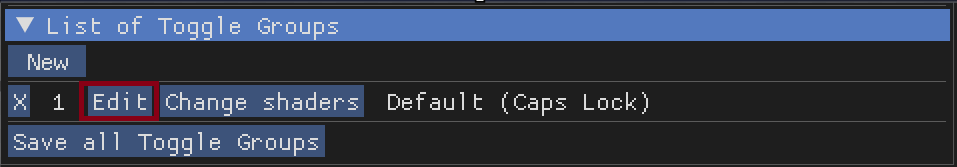
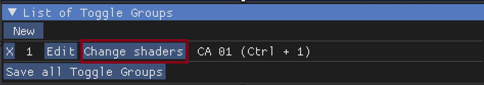
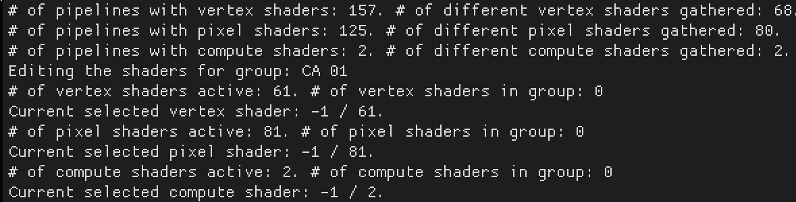
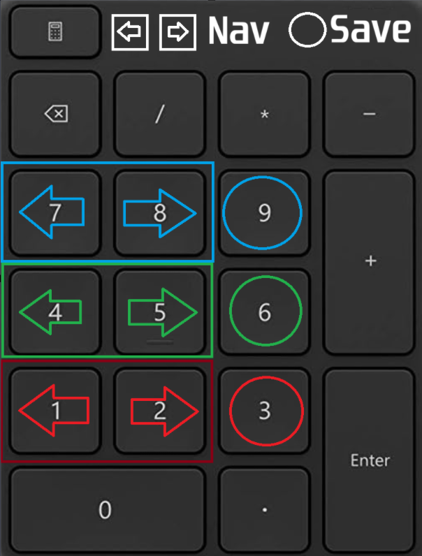

Shader Toggler
==============

The Shader Toggler is a powerful tool for disabling or toggling shaders in games. This guide will walk you through the process of using the Shader Toggler add-on with ReShade.

For this guide, we will be using a free game called *Mimic Search*, which can be downloaded from `Steam <https://store.steampowered.com/app/2713460/Mimic_Search/>`_.

Preface
-------

First, download the ReShade add-on version. You can find more details `here <../reshade/reshadeversions.md>`_.

Requirements
------------

To use the Shader Toggler, download the add-on from its `official GitHub page <https://github.com/FransBouma/ShaderToggler/releases>`_. Make sure to get the right version for your game.

.. figure:: shadertoggler/shadertoggler.jpg

   Screenshot of the Shader Toggler GitHub page.

Installation
------------

Install the game and ReShade along with the :file:`ShaderToggler.addon64`. Turn off all other ReShade shaders to prevent problems.

1. Accessing the Add-on
-----------------------

Start the game and open the ReShade menu. Go to the :guilabel:`add-on` tab:

.. figure:: shadertoggler/shadertoggler2.png

   Screenshot of the ReShade :guilabel:`add-on` tab.

Close other add-ons to make the view clearer. Make sure you are in the game and can see an effect you want to fix, like Chromatic Aberration:

.. figure:: shadertoggler/shadertoggler3.png

   In-game screenshot showing a visible Chromatic Aberration effect.

2. Setting Up the Add-on
------------------------

Move the ReShade menu to the right side of your screen. Click :guilabel:`New`. The menu will change, then click :guilabel:`Edit`:

.. figure:: shadertoggler/shadertoggler4.png

   Screenshot of the ReShade menu with the :guilabel:`New` button highlighted.

   Screenshot of the ReShade menu with the :guilabel:`Edit` button highlighted.

3. Configuring the Add-on
-------------------------

Type a name for the effect, like "CA 01," into the :guilabel:`Name Box`:

.. figure:: shadertoggler/shadertoggler6.png

   Screenshot showing the :guilabel:`Name Box` with "CA 01" entered.

4. Setting Up a Shortcut
------------------------

Create a shortcut for the first group, for example, :kbd:`Ctrl+1`. Click the :guilabel:`Shortcut Box`, press your chosen keys, then click :guilabel:`OK`:

.. figure:: shadertoggler/shadertoggler7.png

   Screenshot showing the :guilabel:`Shortcut Box` with :kbd:`Ctrl+1` configured.

You can choose if the add-on starts automatically. Click :guilabel:`OK` again.

5. Hunting for Shaders
----------------------

Click the :guilabel:`Change shaders` button and let it run for a short time:

   Screenshot of the :guilabel:`Change shaders` button being clicked.

The process will first look like this:

.. figure:: shadertoggler/shadertoggler9.png

   Screenshot showing the :guilabel:`Hunting for shaders` process in progress.

Then it will change to this when finished:

   Screenshot showing the :guilabel:`Hunting for shaders` process completed.

6. Navigation and Saving
------------------------

Use the Number Pad keys to move around and save shaders:

* :kbd:`1` & :kbd:`2` to move, and :kbd:`3` to save Pixel Shaders
* :kbd:`4` & :kbd:`5` to move, and :kbd:`6` to save Vertex Shaders
* :kbd:`7` & :kbd:`8` to move, and :kbd:`9` to save Compute Shaders

For this example, use keys :kbd:`1` and :kbd:`2` to find the shader. Once you find it, save it by pressing :kbd:`3`:

   Screenshot showing a shader being highlighted for saving.

.. figure:: shadertoggler/shadertoggler12.png

   Screenshot showing the "Save" button being pressed.

Click :guilabel:`Done` and then press your shortcut key to turn on the add-on:

.. figure:: shadertoggler/shadertoggler13.png

   Screenshot showing the :guilabel:`Done` button.

.. figure:: shadertoggler/shadertoggler14.png

   In-game screenshot with the Chromatic Aberration effect now disabled.

The shader should now be off. Do this again for any other shaders in the game.

7. Saving Your Progress
-----------------------

Click the :guilabel:`Save all Toggle Groups` button to save what you've done:

.. figure:: shadertoggler/shadertoggler15.png

   Screenshot of the :guilabel:`Save all Toggle Groups` button.

The save file will be in the same folder as the game's executable or the add-on. Here's an example of what the save file might look like:

.. code-block:: ini

   [General]
   AmountGroups=1

   [Group0_VertexShaders]
   AmountHashes=0

   [Group0_PixelShaders]
   ShaderHash0=3090188387
   AmountHashes=1

   [Group0_ComputeShaders]
   AmountHashes=0

   [Group0]
   Name=CA 01
   ToggleKey=822083840
   IsActiveAtStartup=False

Conclusion
----------

Now you know how to use the Shader Toggler to turn off or switch shaders in games. Always remember to save your changes and repeat these steps for other shaders. Happy shader hunting!

Here is an image from in-game with the effect disabled:

.. figure:: shadertoggler/shadertoggler16.png

   Final in-game screenshot with the Chromatic Aberration effect disabled.
