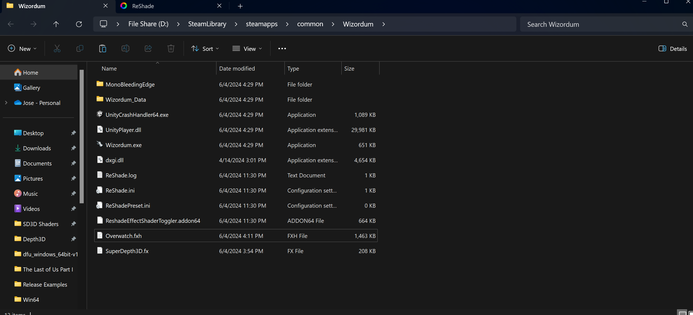
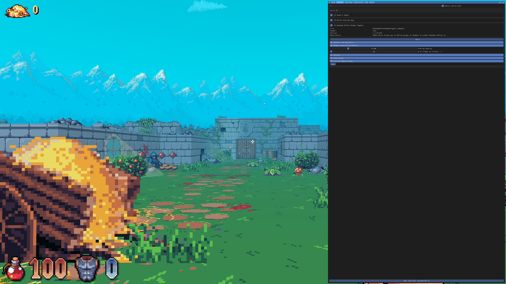
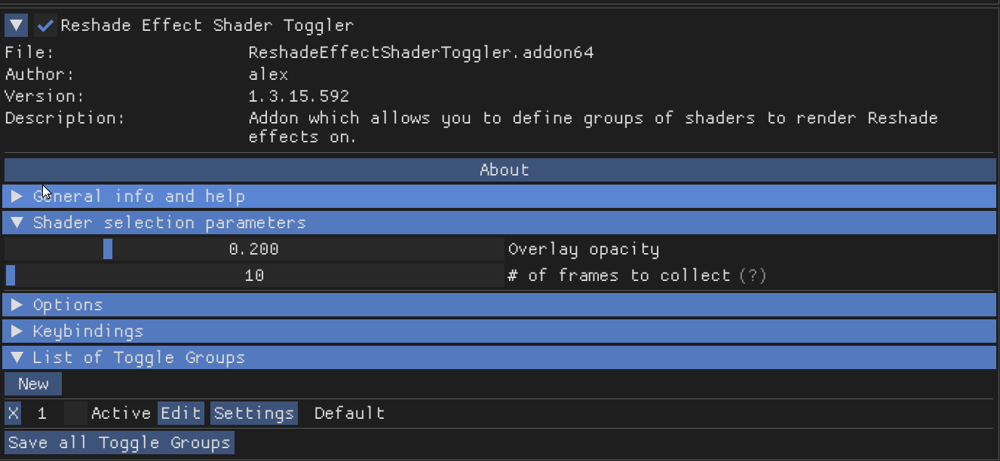
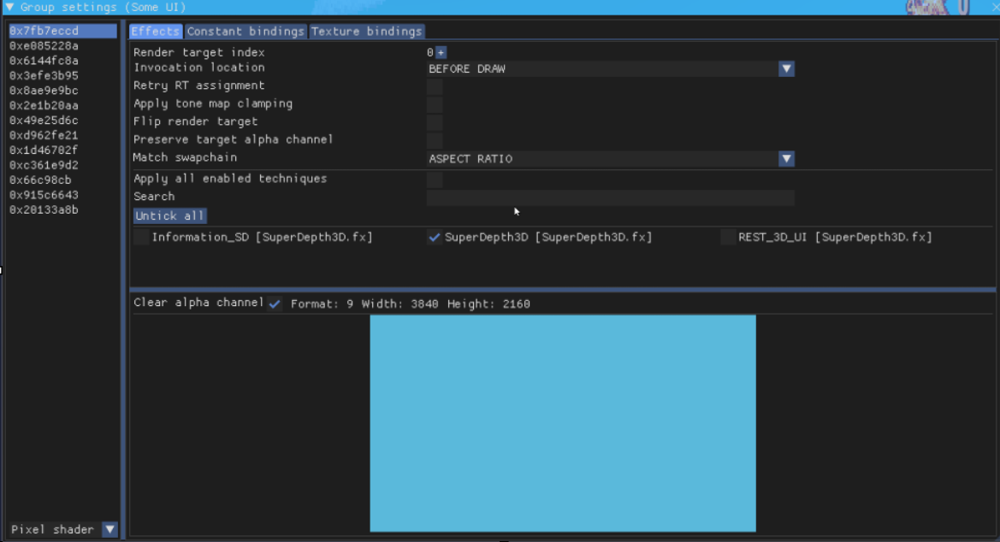
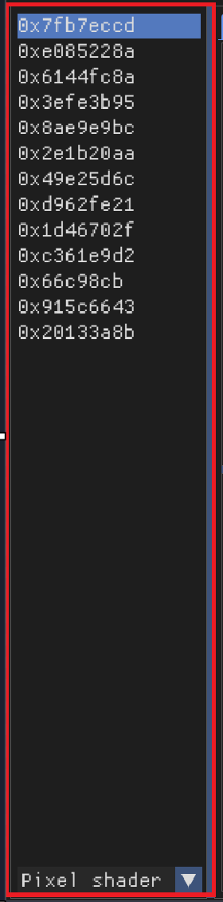

.. _rest-guide:

Reshade Effect Shader Toggler (R.E.S.T)
=======================================

The Reshade Effect Shader Toggler (R.E.S.T) is a powerful tool used to separate effects from the game and layer ReShade shaders under the isolated element.

.. figure:: images/rest/rest.png

   Screenshot of the Reshade Effect Shader Toggler add-on.

Introduction
------------

To get started with R.E.S.T, you will need to download the add-on from the `official GitHub repository <https://github.com/4lex4nder/ReshadeEffectShaderToggler/releases/tag/v1.3.15>`_.

Downloading and Installing the Add-on
-------------------------------------

The release folder contains several files, including shaders, FX files, a license, and a README file. You can ignore the license and README files for now. You will need to use one of the :file:`.addon#` files, but you can drag both into the same area where the :file:`ReShade.dll` is located. For this guide, we will focus on the 64-bit add-on.

Installing the Add-on
---------------------

Place the :file:`ReshadeEffectShaderToggler.addon64` file in the same location where you installed ReShade. This is usually in the game folder, near the :file:`dxgi.dll` file.

Choosing a Game
---------------

For this guide, we will use the game `Wiz⊙rdum <https://store.steampowered.com/app/1715590/Wizordum/>`_. However, you can use R.E.S.T with other games as well.

Setting Up the Add-on
---------------------

Your game folder should look like this:

   Screenshot of the game folder with the add-on installed.

Make sure you have ReShade installed and the add-on file in the correct location.

Launching the Game and Add-on
-----------------------------

Start the game, and ReShade should load with the add-on enabled. You can find the add-on in the :guilabel:`Add-on` Tab:

.. figure:: images/rest/rest1.png

   Screenshot of the ReShade add-on tab.

Click the arrow to open the add-on, and close other add-ons to make it cleaner.

Configuring the Add-on
----------------------

The add-on should look like this:

.. figure:: images/rest/rest2.png

   Screenshot of the opened add-on configuration menu.

Close the ReShade menu and go in-game to use the add-on.

Setting Up the Add-on in-game
-----------------------------

Open ReShade, move it to the right, and click :guilabel:`New`.

   Screenshot showing the :guilabel:`New` button in the ReShade menu.

.. figure:: images/rest/rest4.png

   Screenshot of the new window that appears.

.. rubric:: A new window will open

   Screenshot of the add-on configuration window.

.. rubric:: Follow These Steps

1. Click :guilabel:`Activate [x]`
2. Click :guilabel:`Edit`
3. Type a name in the :guilabel:`Name` field
4. Create a :guilabel:`Shortcut`
5. Click :guilabel:`OK`

Enabling 3D Shader
------------------

If you want to use SuperDepth3D with R.E.S.T, you need to enable the 3D shader. Open the main menu, enable the 3D shader, and scroll down to the bottom of the shader. Enable ``REST_UI_MODE`` by setting it to ``1``:

.. figure:: images/rest/rest8.png

   Screenshot of the shader settings showing REST_UI_MODE.

Configuring the Add-on Settings
-------------------------------

Go back to the Add-on Tab and click :guilabel:`Settings`:

.. figure:: images/rest/rest7.png

   Screenshot of the "Settings" button.

.. rubric:: A new window will open

.. figure:: images/rest/rest9.png

   Screenshot of the add-on settings window.

.. rubric:: Follow These Steps

1. Click off :guilabel:`Apply all enabled techniques [ ]`
2. Mark the 3D shader :guilabel:`[x]`

   Screenshot of the settings after marking the 3D shader.

Isolating the UI
----------------

Focus on the list of active buffers:

   Screenshot of the active buffers list.

Find the buffer that isolates the UI. Double-click the hex value to select it:

.. figure:: images/rest/rest14.png

   Screenshot of a selected hex value.

The selected buffer should turn yellow.

Saving Your Progress
--------------------

Close the window and click :guilabel:`Save all Toggle Groups`:

.. figure:: images/rest/rest15.png

   Screenshot of the "Save all Toggle Groups" button.

Troubleshooting
---------------

You may notice issues with the center crosshair. There are three ways to deal with this:

1. Check if the game allows you to remove it
2. Use the :doc:`ShaderToggler <../../addons/shadertoggler>`
3. Mod the game to remove the texture

Cursor Adjustments
------------------

If you experience issues with the cursor in Side by Side and Top n Bottom formats, go to the :guilabel:`Shader Settings` and look for :guilabel:`Cursor Adjustments`:

.. figure:: images/rest/rest18.png

   Screenshot of the "Cursor Adjustments" menu.

Set the cursor type to the one you prefer:

.. figure:: images/rest/rest19.png

   Screenshot of the cursor type options.

You can use :kbd:`Mouse 5` to switch layers.

Sharing Your Configuration
--------------------------

When you click :guilabel:`Save all Toggle Groups`, a file called :file:`ReshadeEffectShaderToggler.ini` is generated in the same folder as the add-on. You can share this file with others by posting it on the `ReShade forum <https://discord.com/channels/305472403977404416/1248039510244065410>`_.
