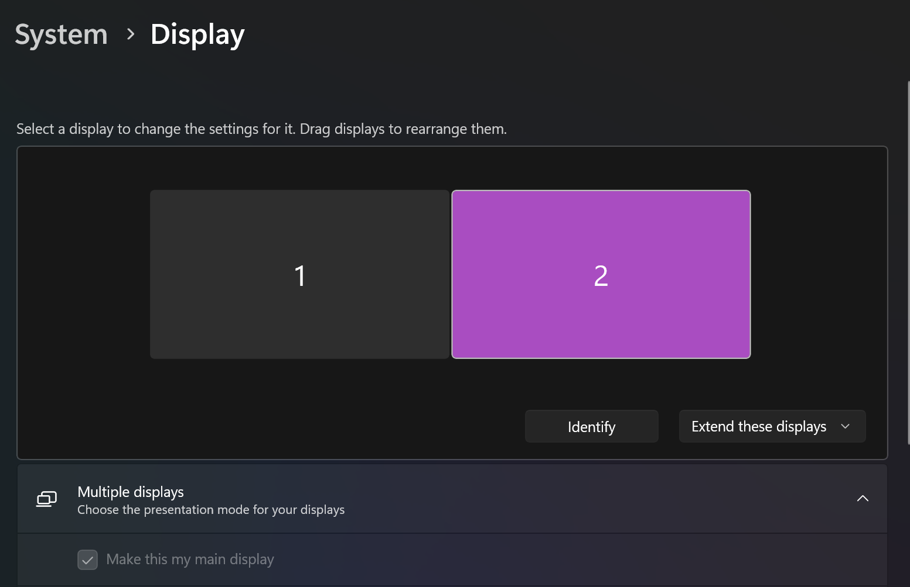

Simulated Reality Displays
==========================

Simulated Reality (SR) Displays, once called Dimenco, are now supported by Leia Inc. This guide will help you use SuperDepth3D with hardware that uses SR technology.

.. rubric:: Main Website

`<https://www.leiainc.com/>`_

.. rubric:: Hardware Developers Links

* Acer `Spatiallabs <https://www.acer.com/us-en/spatiallabs>`_
* ASUS `Spatial Vision <https://www.asus.com/content/asus-spatial-vision-technology/>`_
* Sony `Spatial Reality <https://pro.sony/ue_US/products/spatial-reality-displays/3d-professional-images>`_

.. admonition:: Please note that this guide is intended for hardware with the SR badge.

   .. figure:: images/sr1.jpg

      SR badge logo

Getting Started with SuperDepth3D
---------------------------------

To use SuperDepth3D with SR Displays, you can follow either the simple text guide or the manual guide below.

For a video tutorial, watch this `video guide <https://youtu.be/ovXh54DkKbU>`_.

.. figure:: images/sr2.png

   Screenshot of a video guide.
   SuperDepth3D for Simulated Reality Displays.

Easy Text Guide
---------------

To install ReShade and SuperDepth3D easily, follow these steps:

#. **Download ReShade:** Get the add-on version of `ReShade <https://reshade.me/#download>`_.

   .. figure:: images/sr3.png

      ReShade download page screenshot.

#. **Install ReShade:** Run the ReShade.exe file to install it.

   .. figure:: images/sr4.png

      ReShade installer screenshot.

#. **Select Game Executable:** Choose or find your game's main file (executable). For example, we'll use Forza Horizon 4.

   .. figure:: images/sr5.png

      ReShade installer game selection screenshot.

#. **Click Open:** Press the :guilabel:`Open` button.

#. **Select API:** Choose the API (like DirectX 11 or OpenGL) and click :guilabel:`Next`.

   .. figure:: images/sr6.png

      ReShade installer API selection screenshot.

#. **Select SuperDepth3D:** From the Depth3D Repository, check the box next to :file:`SuperDepth3D.fx`.

   .. figure:: images/sr7.png

      ReShade installer shader selection screenshot.

#. **Click Next:** Press the :guilabel:`Next` button.

#. **Select 3DGameBridgeProjects Add-on:** Make sure to choose the :guilabel:`3DGameBridgeProjects` add-on.

   .. figure:: images/sr9.png

      ReShade installer add-on selection screenshot.

   Click :guilabel:`Next` and then :guilabel:`Finish`.

Manual Guide
------------

If you prefer to install things yourself, follow these steps:

#. **Install ReShade:** Install ReShade or add it to your game. Make sure you use the `add-on version of ReShade <https://reshade.me/#download>`_.

   .. figure:: images/sr10.png

      ReShade installer screenshot.

   If ReShade is already installed, you can skip this step.

#. **Download 3DGameBridge:** Get the newest version of `3DGameBridge <https://github.com/JoeyAnthony/3DGameBridgeProjects/releases>`_.

   .. figure:: images/sr11.png

      3DGameBridge GitHub page screenshot.

#. **Copy Add-ons:** Copy both add-ons, or just the one you need, depending on your game's setup.

   .. figure:: images/sr12.png

      Screenshot of the add-on files.

#. **Paste Add-ons:** Put the add-ons in the same folder as your game's executable file or where ReShade's `.dll` file is installed.

   .. figure:: images/sr13.png

      Screenshot of the game folder with the add-ons.

   Start the game to check if it works.

Important Notes
---------------

When you start the game, you might need to set your main monitor to the Simulated Reality Display. If you don't, the game might not pick the right screen, and you'll see a black screen.

   Screenshot of monitor settings.

Also, make sure the game runs at the correct resolution for your 3D display. If the resolution is too low, the image might look stretched or blurry.

.. figure:: images/sr15.png

   Screenshot of game resolution settings.