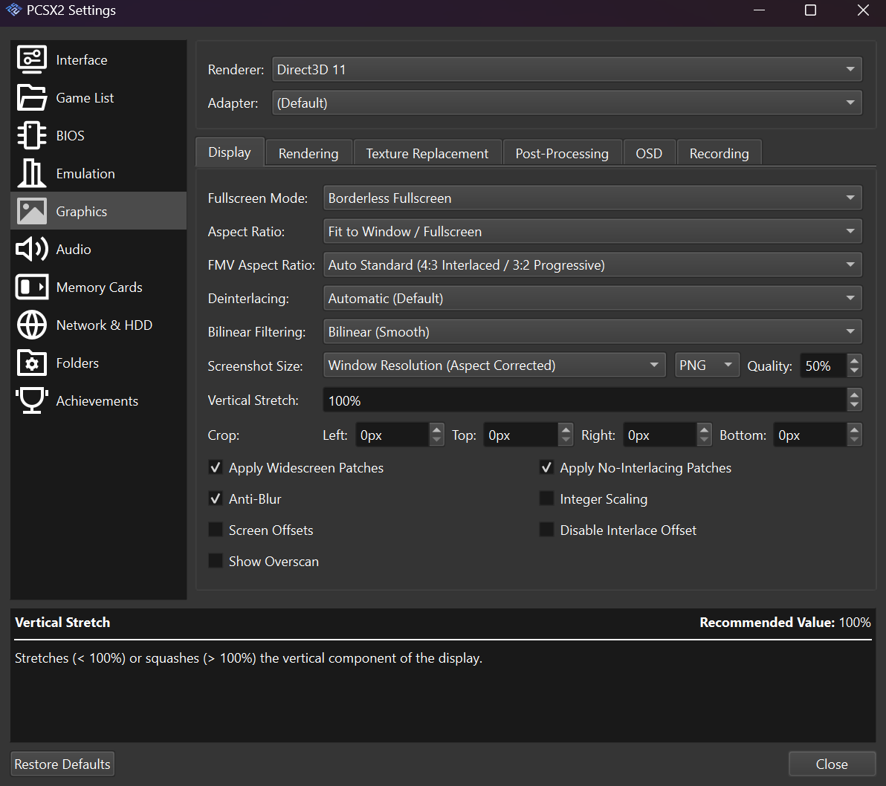
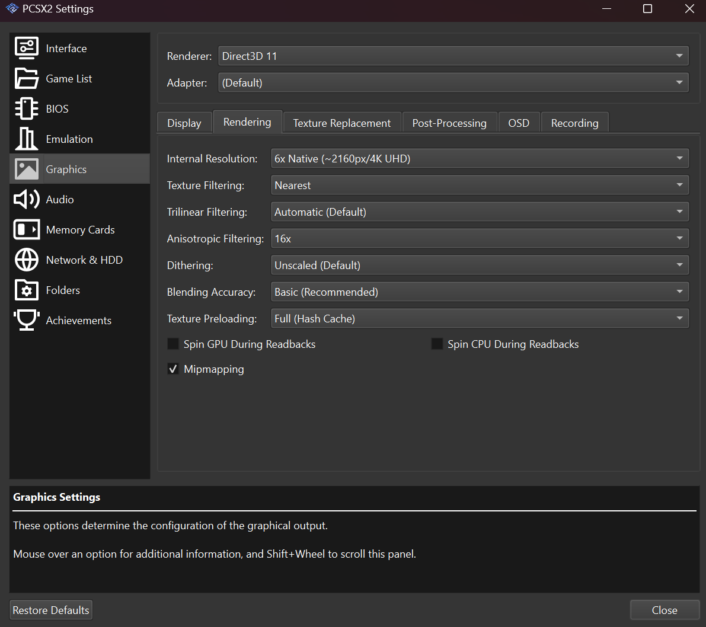

.. _pcsx2-guide:

PCSX2
=====

This guide provides basic adjustments for ReShade and its use in PCSX2: Emulator.

Introduction to PCSX2 Settings
------------------------------

We will be using the DX11 API for this guide due to its compatibility with other add-ons.

Display Settings
^^^^^^^^^^^^^^^^

To access the display settings, navigate to the menu shown below.

   Screenshot of the PCSX2 display settings menu.

#. **Fullscreen Mode & Aspect Ratio:** Set the aspect ratio to :guilabel:`Fit to Window` as shown below.

   .. figure:: images/pcsx2/PCSX2_Fullscreen_AR.png

      Screenshot showing :guilabel:`Fit to Window` aspect ratio selected.

   This is necessary because the depth buffer is set to this internally.

#. **Anti-Blur:** Enable this option to minimize distortions.

   .. figure:: images/pcsx2/PCSX2_Anti-Blur.png

      Screenshot showing the :guilabel:`Anti-Blur` option enabled.

Rendering
---------

We will be using the DX11 API for rendering. You can try different APIs as long as you can get a depth buffer output.

Rendering Options
^^^^^^^^^^^^^^^^^

To access the rendering settings, navigate to the menu shown below.

   Screenshot of the PCSX2 rendering settings menu.

#. **Rendering:** Set the rendering to :guilabel:`Direct3D 11` as shown below.

   .. figure:: images/pcsx2/PCSX2_Renderer.png

      Screenshot showing :guilabel:`Direct3D 11` selected as the renderer.

   This ensures compatibility with most of ReShade's add-ons.

#. **Internal Resolution:** Set the internal resolution to :guilabel:`Native` for most cases.

   .. figure:: images/pcsx2/PCSX2_Rendering.png

      Screenshot showing :guilabel:`Native` resolution selected.

   This also helps with ReShade's generic depth add-on.

Installing and Configuring ReShade
----------------------------------

To use ReShade with PCSX2, follow these steps:

#. **Install ReShade:** Install ReShade under your current API setting. You can find the installation guide `here <../reshade/reshadeversions.md>`_.

#. **Turn off the emulator and install ReShade.**

#. **Start your game and go into the ReShade menu.**

#. **Check the depth buffer:** Check the depth buffer in the add-ons tab.

   .. figure:: images/pcsx2/PCSX2_ReShade_Depth_Add-on.png

      Screenshot of the ReShade add-ons tab showing the depth buffer.

Additional Information
----------------------

Make sure to complete any additional setup, such as configuring games and BIOS, on your end.

Conclusion
----------

This guide provides a good starting point for using ReShade with PCSX2. However, note that the optimal settings may vary depending on the game.
