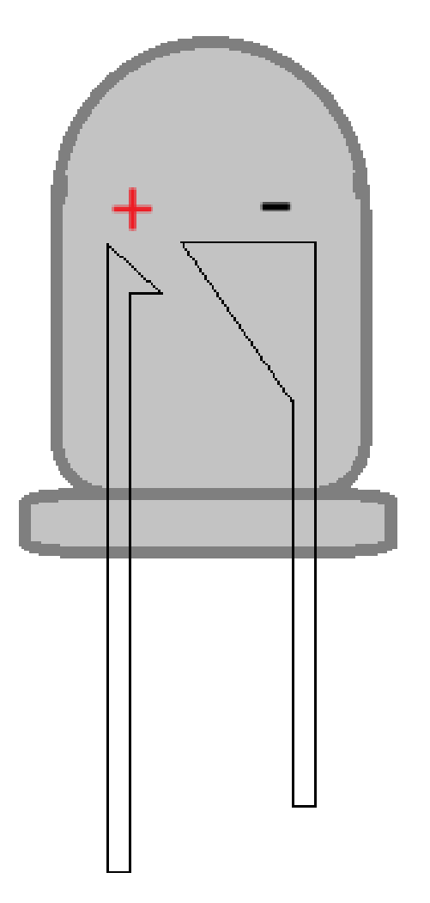
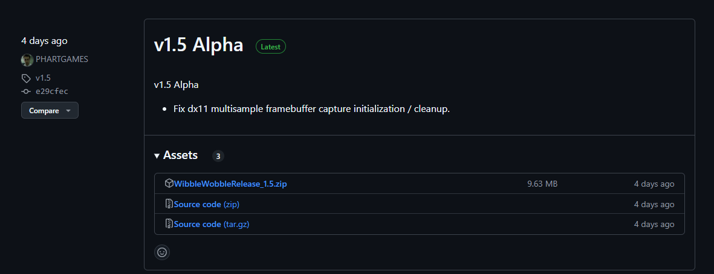
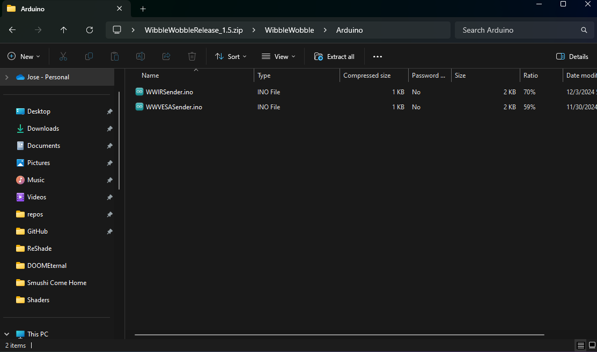

Frame Sequential (Monitor)
==========================

IR Emitter (IR Blaster)
-----------------------

An IR Emitter, also known as an IR Blaster, is essential for the Frame Sequential 3D method discussed in this guide.

.. image:: images/ww_monitor/ww_monitor1.png
   :alt: IR Emitter

Why do you need an IR Emitter?
^^^^^^^^^^^^^^^^^^^^^^^^^^^^^^

This device is necessary to enable the use of IR (Infrared) 3D Glasses for viewing 3D content on compatible screens.

What parts do you need?
^^^^^^^^^^^^^^^^^^^^^^^

To build your IR Emitter, you will need some basic electronic components: an Arduino board, a breadboard, an IR LED, wires, and a resistor.

Below are some affiliate links to Amazon products that can be used for this project. Please select one item from each category.

Arduino or Compatible Boards:
   - **Arduino UNO:** https://amzn.to/3DfaJ6a
   - **KEYESTUDIO Leonardo:** https://amzn.to/3ZBlFT7

Breadboard Kits with Cables:
   - **Option One:** https://amzn.to/3ZUcfU6
   - **Option Two:** https://amzn.to/49FLxSd

Resistors - 220 Ohms:
   - **Option One:** https://amzn.to/3ZD3QmG
   - **Option Two:** https://amzn.to/4geNrMf

IR LEDs:
   - **Option One:** https://amzn.to/3ZUcfU6
   - **Option Two:** https://amzn.to/3VGQRzd
   - **Option Three:** https://amzn.to/3DmpvrJ

3D Glasses:
   - **144Hz Rechargeable DLP Glasses:** https://amzn.to/41ElhWu
   - **XPAND X105-IR-X1 Rechargeable 3D Infrared Glasses:** https://amzn.to/49I7Ref

   .. note::
      When choosing 3D glasses, pay close attention to their polarization:

      - **Vertically Polarized Glasses:** These will block the image on your screen if your monitor is in portrait mode.
      - **Horizontally Polarized Glasses:** These will block the image on your screen if your monitor is in the normal landscape (horizontal) position.

If you choose the Arduino UNO, you will also need a USB B cable.

Extra Items (USB Cables):
   - **3 Foot USB A to USB B Cable:** https://amzn.to/3OXlwnQ
   - **6.6 Foot USB B to USB C Cable:** https://amzn.to/3OYQMTz

.. important::
   Understanding the polarization of your 3D glasses is crucial for screen compatibility. For example, if you plan to play 3D pinball games, which often use vertically oriented screens, you would typically need horizontally polarized glasses.

.. warning::
   Screen polarization can vary. It\'s possible that your chosen 3D glasses may not work with certain screens due to conflicting polarization directions. In such cases, you may need to acquire glasses with the opposite polarization.

.. note::
   While some older 3D screens have built-in IR emitters, this guide focuses exclusively on setting up new screens for 3D viewing.

Wiring
------

.. image:: images/ww_monitor/ww_monitor2.png
   :alt: Wiring Diagram

Refer to the wiring diagram above. We have designed this setup to be as straightforward as possible.

- Connect the **Red Wire** from **Digital Port 4** on the Arduino to the **Red Lane** (positive rail) on the breadboard.
- Connect the **Black Wire** from the **Ground Port** on the Arduino to the **Black Lane** (negative rail) on the breadboard.

.. note::
   Resistors are non-polarized components, meaning their orientation does not matter. Place the **220 Ohm Resistor** between the **Red Lane** and **Column 2** on the breadboard.

.. note::
   LEDs are polarized components, meaning they have a specific orientation. Place the **IR LED** with its leads in **Column 2** and **Column 3**, across either **Row F** or **Row G**.

Finally, use a smaller wire to connect the **Black Lane** to **Column 3** on the breadboard.

LED Polarization: Additional Information
^^^^^^^^^^^^^^^^^^^^^^^^^^^^^^^^^^^^^^^^

Typically, the longer 'leg' or pin of an LED indicates the **ANODE (+) Positive** terminal. If the leads have been trimmed, look for a flat edge on the LED casing, which marks the **CATHODE (-) Negative** terminal.

.. warning::
   Incorrectly wiring the IR LED can cause it to \"pop\" and be destroyed. Always ensure correct polarization.

Additionally, improper wiring can damage the ports on your Arduino board.

.. image:: images/ww_monitor/ww_monitor4.png
   :alt: Not Safe Wiring Example

Always heed these warnings to prevent damage to your components.

Setting up the board
--------------------

With the wiring complete, it's time to prepare the software. **Begin by plugging in your Arduino board to your computer.**

1. **Download the Arduino IDE**

   First, you need to install the Arduino Integrated Development Environment (IDE) and its drivers. This software is essential for programming your Arduino board.

   .. image:: images/ww_monitor/ww_monitor5.png
      :alt: Arduino IDE Download

2. **Run the Installer**

   Execute the downloaded installer file.

   .. image:: images/ww_monitor/ww_monitor6.png
      :alt: Arduino IDE Installer

3. **Install Drivers**

   During the installation, you will be prompted to install necessary drivers. Agree to these prompts; they are safe.

   .. figure:: images/ww_monitor/ww_monitor7.png
      :alt: Arduino Driver Installation

      You may see several pop-up windows; please accept them to ensure proper driver installation.

4. **Start the Arduino IDE**

   Once the installation is complete, launch the Arduino IDE.

   .. image:: images/ww_monitor/ww_monitor8.png
      :alt: Start Arduino IDE

5. **Configure the Board in the IDE**

   You will need to select your specific Arduino board and the correct communication port (COM Port) within the IDE.

   .. image:: images/ww_monitor/ww_monitor9.png
      :alt: Arduino IDE Board Setup

6. **Select Your Board and COM Port**

   Navigate through the IDE menus to select your Arduino board model and the COM port it is connected to.

   .. image:: images/ww_monitor/ww_monitor10.png
      :alt: Select Board and COM Port

   .. note::
      The specific COM port (e.g., COM5) and board name (e.g., Keystudio Leonardo) will vary depending on your system and the Arduino board you are using.

7. **Verify IDE Setup**

   Your Arduino IDE should now display the selected board and port, similar to the image below.

   .. image:: images/ww_monitor/ww_monitor11.png
      :alt: Arduino IDE with Board Selected

**Download WibbleWobble Software**

If you haven't already, download the latest `WibbleWobble Release <https://github.com/PHARTGAMES/WibbleWobbleCore/releases/>`_ from GitHub.

.. note::
   The `Patreon <https://www.patreon.com/PHARTGAMES>`_ version of the WibbleWobble software offers additional features. This guide, however, focuses on the free version.

After extracting the downloaded files, you will find two or more files within the WibbleWobbleCore folder.

.. image:: images/ww_monitor/ww_monitor14.png
   :alt: WibbleWobbleCore Folder Contents

Locate and double-click the :file:`WWIRSender.ino` file. This action will open the sketch directly within the **Arduino IDE**.

Ensure you have extracted all files from the downloaded archive before attempting to open the :file:`.ino` file.
