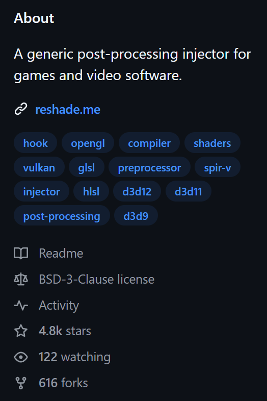
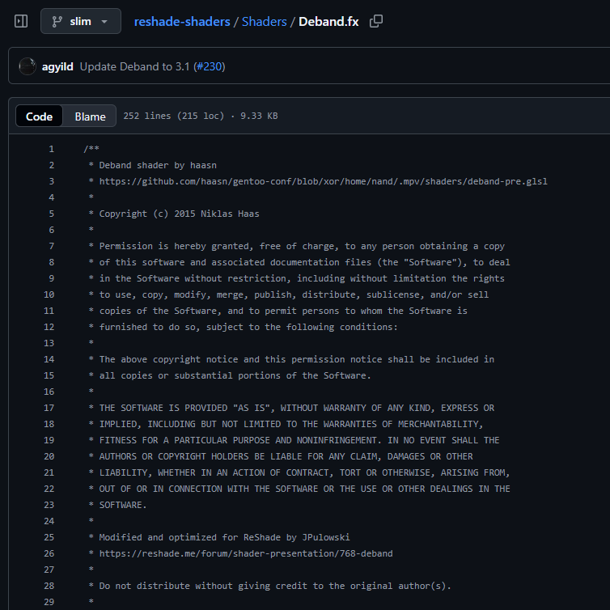

United States Copyright
=======================

"What is copyright?"
--------------------

Copyright is a legal protection given to original works created by authors. These works must be in a "tangible form," meaning they can be seen, heard, or touched, like a book, a song, a photograph, a computer program, or a painting. You can access these works directly or with the help of devices, such as reading a book or listening to music on a player [1]_.

Essentially, copyright gives the creator certain exclusive rights over their work. These rights include:

- **Reproduction:** Making copies of the work.
- **Distribution:** Selling or giving away copies of the work.
- **Public Performance:** Performing the work publicly (e.g., playing a song in a concert).
- **Public Display:** Showing the work publicly (e.g., displaying a painting in a gallery).
- **Derivative Works:** Creating new works based on the original (e.g., a movie based on a book).

.. important::

   It's important to understand what copyright *doesn't* protect. Copyright does not cover ideas, procedures, processes, systems, methods, concepts, principles, or discoveries. It only protects the *way* an idea is expressed, not the idea itself. This means that while you can't copy someone's specific story, you can still write your own story using a similar general idea. This rule helps make sure that basic ideas and facts remain free for everyone to use and build upon. [1]_

.. _limitations:

"Who is copyright for?"
-----------------------

Copyright is primarily for individuals or organizations who want to protect their original creations. This protection allows them to control how their work is used and shared. It applies whether they want their work to be widely available (open) or kept private and restricted (closed).

For creators, copyright helps answer key questions:

"Can I stop others from using my original work?"
   Yes, copyright generally gives you the legal right to prevent others from copying, distributing, performing, or displaying your work without your permission. This means you can decide who gets to use your creation and under what conditions.

"Can I use another person's original work?"
   Generally, no, not without permission from the copyright holder. If you want to use someone else's copyrighted material, you usually need to get a license or explicit consent. There are some exceptions, like "fair use" in the United States, which allows limited use of copyrighted material without permission for purposes such as criticism, comment, news reporting, teaching, scholarship, or research. However, fair use is a complex legal doctrine and its application depends on specific circumstances.

"When does my work get copyrighted?"
------------------------------------

In the United States, your work is automatically copyrighted the moment it is created and put into a tangible form. You don't need to register it with the U.S. Copyright Office or even put a copyright notice (like ©) on it to have basic copyright protection. For example, if you take a photograph of a celebrity, you instantly own the copyright to that picture under U.S. law.

However, while automatic copyright protection exists, registering your work with the U.S. Copyright Office offers significant benefits:

- **Public Record:** It creates a public record of your copyright claim.
- **Ability to Sue:** You generally cannot sue someone for copyright infringement in federal court until your work is registered.
- **Statutory Damages and Attorney's Fees:** If you register your work before an infringement occurs (or within three months of publication), you may be eligible to receive statutory damages and attorney's fees in a lawsuit, which can be much easier to prove than actual damages.

Regarding the example of photographic work, if you are hired by a company to take photos, the copyright might belong to the company, not you. This is often the case with "work for hire" agreements, where the employer or commissioning party is considered the author and copyright owner of the work created by an employee within the scope of their employment, or a specially ordered or commissioned work if certain conditions are met and agreed upon in writing.

"Where is the source code's copyright?"
---------------------------------------

For software and source code, you can typically find copyright information within specific files that are part of the project. The most common places are:

- :file:`LICENSE`: This file explicitly states the terms under which the software can be used, modified, and distributed. It will often include the copyright holder's name and the year the copyright was established.
- :file:`README`: While primarily used for project descriptions and instructions, :file:`README` files often contain a section dedicated to licensing and copyright information.

For shader developers, if you are browsing a shader repository on platforms like GitHub or GitLab, you can often find the licensing and copyright information by looking for a :guilabel:`License` tab or section directly on the repository's main page. Clicking on this will usually display the full text of the license.

   The license tab of the `ReShade source code <https://github.com/crosire/reshade>`_.

Additionally, you might find copyright notices directly within the source code files themselves, often at the top of each file as a comment. This practice helps ensure that the copyright information is readily available to anyone reviewing the code.

   The copyright of the `ReShade port of Deband <https://github.com/crosire/reshade-shaders/blob/slim/Shaders/Deband.fx>`_.

"Why do we need copyright?"
---------------------------

In the United States, the primary purpose of copyright law is to "promote the Progress of Science and useful Arts." This means copyright aims to encourage creators to produce new works by giving them exclusive rights to their creations for a limited period. [1]_ Here's why this is important:

- **Incentive for Creation:** By granting creators exclusive rights, copyright provides a financial and creative incentive. Knowing they can control and profit from their work encourages artists, writers, musicians, and developers to invest their time, effort, and resources into creating new content.
- **Balance Between Creators and Public:** The "limited time" aspect is crucial. It ensures that after a certain period, copyrighted works eventually enter the public domain. Once in the public domain, anyone can use, adapt, and build upon these works without needing permission or paying royalties. This balance allows creators to benefit from their work while eventually enriching the public domain for future generations to access and innovate upon.

Without copyright, it would be much harder for creators to earn a living from their work, potentially leading to less new creative content being produced. It helps foster a vibrant environment for innovation and artistic expression.

"How long does copyright last?"
-------------------------------

As a general rule, for works created after January 1, 1978, copyright protection lasts for the life of the author plus an additional 70 years. [2]_ This duration applies to most individual works. For works made for hire, anonymous works, or pseudonymous works, copyright protection lasts for 95 years from the year of its first publication or 120 years from the year of its creation, whichever expires first.

This information is based on guidelines from the U.S. Copyright Office.

Disclaimer
----------

The authors of this page are not legal professionals. The information provided here is for general informational purposes only and does not constitute legal advice. For specific legal matters, please consult with a qualified legal professional.

References
----------

.. [1] Copyright basics. (2025). United States Patent and Trademark Office. https://www.uspto.gov/ip-policy/copyright-policy/copyright-basics
.. [2] Copyright duration. (2025). U.S. Copyright Office. https://www.copyright.gov/help/faq/faq-duration.html
