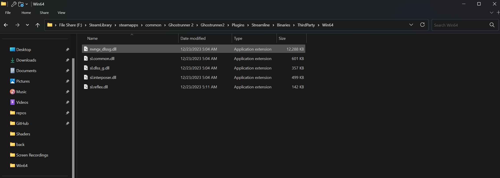
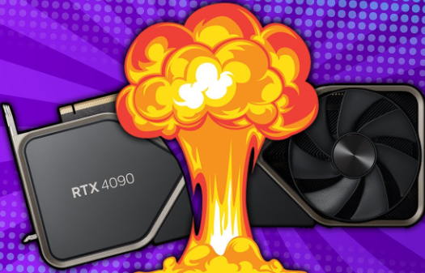

Disabling DLSS Frame Generation
===============================

Introduction
------------

This guide shows two ways to turn off DLSS Frame Generation, which can sometimes make games crash. The first way turns it off for all games on Windows, and the second shows how to turn it off for just one game.

.. admonition:: Note

   You don't need to do this if you have an Intel or AMD graphics card.

Method 1: Global Disable
------------------------

To turn off DLSS Frame Generation for all games, follow these steps:

Step-by-Step Instructions
^^^^^^^^^^^^^^^^^^^^^^^^^

#. **Access Display Settings:** Go to :guilabel:`Display Settings` on your Windows computer.

   .. figure:: images/dlssfg/dlssfg1.png
      :width: 50%

      Display Settings page.

#. **Navigate to Graphics Settings:** Next, go to :menuselection:`System --> Display --> Graphics` and click on :guilabel:`Change default graphics settings`.

   .. figure:: images/dlssfg/dlssfg2.png
      :width: 50%

      Graphics settings page.

#. **Locate Hardware Accelerated GPU Scheduling:** After clicking the option above, find **Hardware Accelerated GPU Scheduling**.

   .. figure:: images/dlssfg/dlssfg3.png
      :width: 50%

      Hardware Accelerated GPU Scheduling option.

#. **Disable Hardware Accelerated GPU Scheduling:** Turn off **Hardware Accelerated GPU Scheduling**.

   .. figure:: images/dlssfg/dlssfg4.png
      :width: 50%

      **Hardware Accelerated GPU Scheduling** turned off.

#. **Restart Your PC:** Restart your computer for the changes to take effect. This should turn off Frame Generation everywhere.

Method 2: Game-Specific Disable
-------------------------------

We'll use **Ghost Runner 2** as an example here. Most games will have a similar process.

.. figure:: images/dlssfg/dlssfg5.png
   :width: 25%

   Ghost Runner 2 game title.

To turn off DLSS Frame Generation for a specific game, follow these steps:

Step-by-Step Instructions
^^^^^^^^^^^^^^^^^^^^^^^^^

#. **Locate the nvngx_dlssg.dll File:** Look for a file named :file:`nvngx_dlssg.dll`. In this example, it's in the `Streamline <https://developer.nvidia.com/rtx/streamline>`_ folder:

   .. figure:: images/dlssfg/dlssfg7.png
      :width: 75%

      Location of the nvngx_dlssg.dll file.

#. **Rename the nvngx_dlssg.dll File:** Change the name of :file:`nvngx_dlssg.dll` to :file:`nvngx_dlssg.back`.

   .. figure:: images/dlssfg/dlssfg8.png
      :width: 75%

      File being renamed.

Example Screenshot
------------------

Here's an example screenshot of the game with DLSS Frame Generation disabled:

   Game screenshot with DLSS Frame Generation disabled.

Conclusion
----------

   Thank you for reading the guide.

That's all for now. We'll add more examples for other games later. We hope this guide helped you fix any issues with DLSS Frame Generation!
