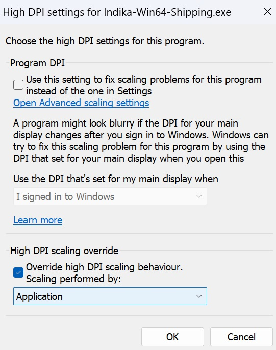

Game Windows DPI Settings
=========================

Introduction to DPI Scaling Issues
----------------------------------

Have you ever experienced blurry text, images, videos, websites, or games on your Windows system? This issue can also affect the performance and clarity of ReShade and Depth3D. The culprit behind this problem is often related to the Windows DPI \(Dots Per Inch\) settings. In this guide, we will walk you through a step-by-step process to resolve this issue and improve the overall visual quality of your games and applications.

Identifying the Problem
-----------------------

The symptoms of DPI scaling issues can manifest in various ways, including:

* Blurry or pixelated text and images
* Distorted or stretched videos and websites
* Poor game performance and graphics quality
* ReShade and Depth3D not functioning as expected

Resolving DPI Scaling Issues
----------------------------

To fix the DPI scaling issue, follow these simple steps:

Step 1: Accessing the Game's Properties
^^^^^^^^^^^^^^^^^^^^^^^^^^^^^^^^^^^^^^^

#. **Locate the game's executable file:** Find the :file:`.exe` file associated with the game you want to fix.
#. **Right-click on the executable file:** Click on the game's executable file with your right mouse button.
#. **Select Properties:** From the context menu, select the :guilabel:`Properties` option.

Step 2: Adjusting the Compatibility Settings
^^^^^^^^^^^^^^^^^^^^^^^^^^^^^^^^^^^^^^^^^^^^

#. **Select the Compatibility tab:** In the Properties window, click on the :guilabel:`Compatibility` tab.
#. **Click on Change High DPI Settings:** In the Compatibility tab, click on the :guilabel:`Change High DPI Settings` button.
#. **Override high DPI scaling behavior:** At the bottom of the window, check the box next to **Override high DPI scaling behavior**.
#. **Select the scaling mode:** Open the pull-down menu and select :guilabel:`Application`.

Example Screenshot
------------------

For reference, here is an example screenshot of the Windows DPI settings window:

   Screenshot of the Windows DPI settings window.

Global DPI Scaling Solution
---------------------------

While the above steps provide a solution for individual games, there may be a global way to adjust the DPI settings for all applications. However, the effectiveness of this approach may vary across different versions of the Windows operating system. If you're interested in exploring a global solution, you can search for additional resources and tutorials online.

By following these steps, you should be able to resolve the DPI scaling issue and enjoy clearer text, images, and videos in your games and applications.
