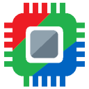

GPU Selector
============

:Author: Jose Negrete (BlueSkyDefender)
:Website: `GPU Selector Online <https://blueskydefender.github.io/GPUSelector/ >`_
:License: Personal Non-Commercial License (NC-ND-NR)

   The GPU Selector logo.

`GPU Selector <https://github.com/BlueSkyDefender/GPUSelector>`_ is a powerful multi-GPU game launcher and management tool for Windows 10 and 11. It provides a centralized interface for users with multiple graphics cards (e.g., Integrated + Dedicated, or dual Dedicated GPUs) to control which hardware their games and applications use.

Beyond simple GPU switching, it features deep integration with ReShade and various graphics translation layers, making it an essential utility for modern and retro gaming enthusiasts.

Key Features
------------

- **Multi-GPU Management**: Force any game or application to run on a specific GPU using multiple methods (Windows GPU Preference, Vulkan Config, or Monitor Switching).
- **Centralized Game Library**: Automatically scans and imports games from Steam, GOG, Epic Games, and other launchers.
- **Emulator Support**: Built-in ROM scanning and per-emulator configuration management.
- **Graphics Translation Layers**: Integrated support for:
    - **DXVK / VKD3D-Proton**: Translate DirectX 9/10/11/12 to Vulkan for better performance or compatibility.
    - **dgVoodoo2**: For legacy DirectX 1-8 and 3dfx Glide support.
    - **WineD3D / Zink**: Additional translation options for OpenGL and Vulkan.
- **Modding Codex**: A curated database of community-driven modding projects and game preservation resources.
- **Accessibility**: Includes an "OpenDyslexic" font mode and high DPI scaling support.

ReShade Integration
-------------------

GPU Selector is designed with ReShade users in mind. It simplifies the process of managing ReShade installations across your entire game library:

- **Easy Installation**: Install ReShade directly to any game from within the GPU Selector interface.
- **Version Management**: Keep track of and switch between different ReShade versions for compatibility.
- **Add-on Support**: Manage ReShade add-ons alongside your shaders.
- **Global Shortcuts**: Quick access to ReShade settings and configuration files.

Getting Started
---------------

1. **Download**: Get the latest version of `GPU Selector from the GitHub Releases page <https://github.com/BlueSkyDefender/GPUSelector/releases>`_.
2. **Install**: Run the setup executable and follow the installation prompts.
3. **Scan**: On first launch, GPU Selector will scan your system for installed games. You can also manually add executables.
4. **Configure**:
    - Select a game from the list.
    - Choose your preferred GPU from the dropdown menu.
    - (Optional) Enable translation layers like DXVK or install ReShade.
5. **Launch**: Click the **Launch** button to start your game with the applied settings.
