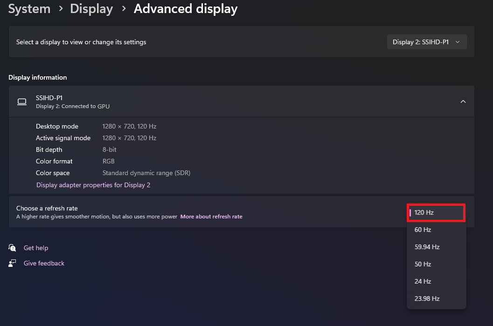
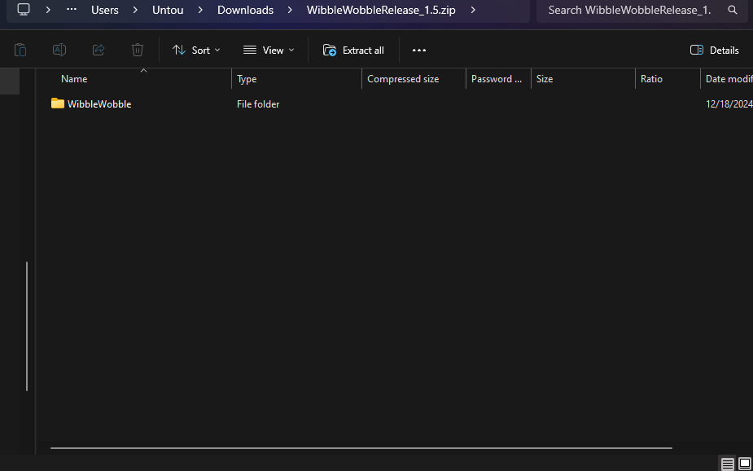
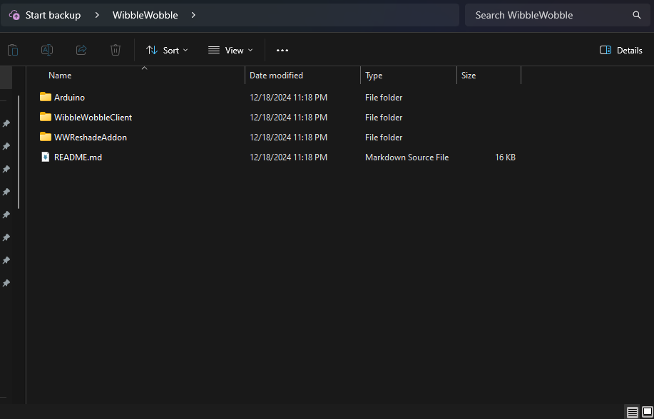

Frame Sequential (Projector)
============================

Questions and Answers
---------------------

:What kind of projectors can I use?:
   The main type of projectors supported are DLP Projectors. However, other projectors that use Frame Sequential 3D technology should also work.

:What kind of glasses do I need?:
   You will need the same type of glasses that your projector requires for 3D viewing.

:What do I need to do after getting both?:
   First, let's set up your Windows operating system. There are two ways to do this.

Method 1: Set Projector as Main Display
^^^^^^^^^^^^^^^^^^^^^^^^^^^^^^^^^^^^^^^

You can set your projector as the main screen. Make sure its resolution matches the native 3D resolution your projector uses.

For example, I need to set my resolution to 1280 x 720 at 120Hz, even if my projector can output 1080p at 60Hz.

.. image:: images/ww_projector/ww_projector1.png
   :alt: Example of projector settings 1

This method ensures the game appears directly on your **main** display, which is your **Projector**.

Method 2: Duplicate Displays (Not Recommended)
^^^^^^^^^^^^^^^^^^^^^^^^^^^^^^^^^^^^^^^^^^^^^^

The other way is to duplicate your displays. However, this is generally not recommended.

.. image:: images/ww_projector/ww_projector3.png
   :alt: Example of duplicating displays

.. warning::

   We do not recommend duplicating displays for these reasons:

   - Your monitor might not have a high refresh rate.
   - Even if it does, some screens can suffer from image retention. To avoid potential problems, please use Method 1.

.. note::

   If you choose to use Method 2, ensure both screens are configured according to your projector's Frame Sequential 3D recommendations.

Installing the App & Addon
--------------------------

Now that your hardware is set up, it's time to download and install WibbleWobbleCore.

.. seealso::

   You can find the latest releases here: `WibbleWobbleCore Releases <https://github.com/PHARTGAMES/WibbleWobbleCore/releases>`_.

.. image:: images/ww_projector/ww_projector4.png
   :alt: Screenshot of WibbleWobbleCore releases page

Click the download link and save the file.

.. image:: images/ww_projector/ww_projector5.png
   :alt: Screenshot of saving the WibbleWobbleCore file

Extract the **WibbleWobble Folder** to any location you prefer.

The contents of the folder should look like this:

